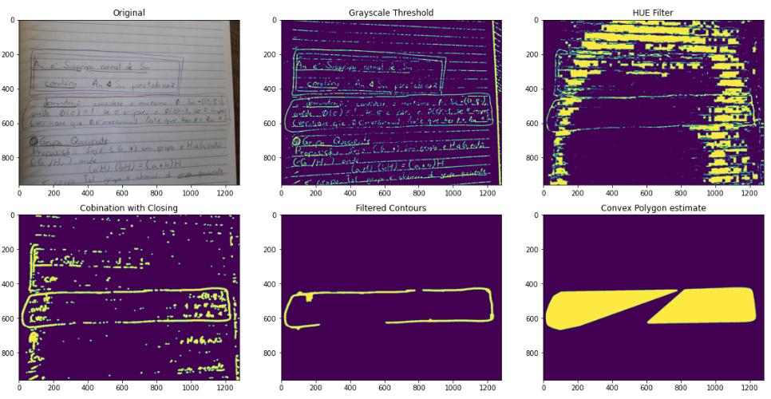
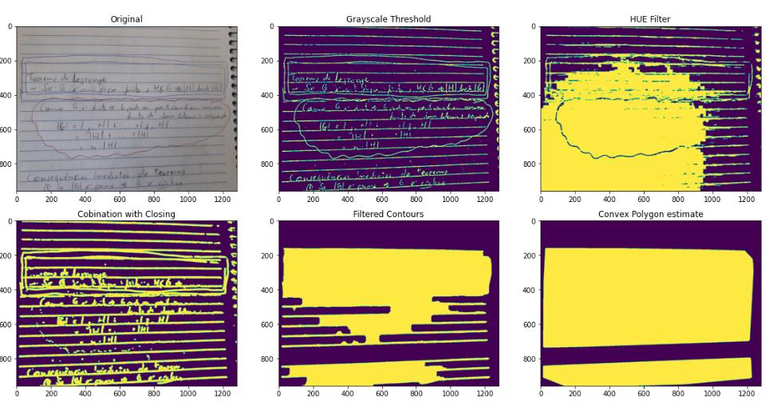

# scc0251 - Final Project : Segmentation of Handwritten Notes for Fast Flashcard Generation

# Final Report

Author: Tobias Mesquita Silva da Veiga, 5268356

This is my final project of the Image Processing lectures taught at the ICMC-USP in 2020.01.

## Abstract

The goal here is to create an algorithm capable of 1) receiving real photos of handwritten students notebooks in which blocks of content are highlighted and 2) Returning the segmented region with only the highlighted content (this will be a side of a flashcard), while also 3) using OCR to retrieve textual information that could be used for recommending tags for the flashcard.

Therefore this project targets the educational area, through the use of image segmentation techniques. 

## Objective

The goal initally was to segment higlighted regions in students notes for any mehtod used by the student to highlight those regions.

Turns out that, although it can be very clear for us where is a highlighted region in someones notes, it can be very hard to specify this in an algorithm. Therefore I stepped down and tried to make the problem more simple.

The current objective is to segmente regions based on a selected color. The colors used are going to be the common red and blue used in pens.

## Image dataset

The pictures were taken by a cell cellphone and no lightning, color or angle control was stricly used, as the algorithm would be expected to work in a wide range of cenarios. The dataset contains three pictures from a notebook with horizontal lines and other two with a blank background. Examples of both types are below.

## Method

In summary the method consisted of using both grayscale thresholding and HUE filtering to detect contours. Then some refinement was made to the contours and a convex hull estimation was used to close and fill the contours.

The method in more details goes as the following.

**1) Blurring the image** The image was blurred to allow a better thresholding in the grayscale image.

**2) Grayscale transformation:** From the blurred image a grayscale image was generated

**3) Thresholding:** Adaptative gaussian thresholding ws applied to the grayscale image. Global thresholding was not interesting since in study enviroments, light sources and shadows can make the notebook paper have a large range of brightness for the whole content. The idea here was to get all possible visible lines. This method worked very well for detecting most of what can be perceived as line. Unfornatelly a few important lines started to fade and not look connected anymore

**4) HUE filtering:** The HUE was filtered according to the selected pen color. A HUE range is selected for each pen color and everything that is not in this range is removed. This generated weird images, but was enough for not selecting lines with pen colors that were not selected. Unfornatelly, just like with the precious filter, this one also degenerated some important lines, and even more.

**5) Combining + Dilation:** Both the grayscale thresholded image and the HUE filtered image are binary images which allow us to apply binary operations. In this case, a new binary image was created by applying the AND operation with both binary images. This new image contains de desired contour but has contour is degenerated because it contains many holes. Also there are many fragments of other image objects that may be too close to the desired contour. The image was dilated to fix some holes.

**6) Contour finding and filtering:** The contours were detected and only contours in which the total lengh in the x axis or the y axis was larger than a given threshold were maintaned. This removed most of the unwanted fragments, but not all of them.

**7) Closing:** Closing was applied to the remaining contours to remove more holes.

**8) Small fragment removal**: Now it is expected the desired curve is large enough. So an area filter is used to remove objects with small area.

**9) Fitting a convex polygon:** The image at this point is basically only the desired contour with a few holes still. Perceptually speaking it is very easy to see what is the contour at this point, but it is very hard to use algorithms to fix this. Since the overall shape of the contour is already revealed, the convex hull algorithm was used to fit a convex polygon around the remaining curve. Finally, each polygon was filled and the aproximated segmented regions were obtained.

## Results
The proposed algorithm worked very well for blanked background. For the backgrounds with blue lines, results were much worse especially if the blue colour was selected for highliht because it was to discrimante blue highlight from the background lines.

**Red color - Blank background**

Easy scenario.

**Red color - Blue lines background (A)**

This one is interesting. Notice that the convex hull algorith will only perform well if there is at most on hole in the contour. Otherwise this will happen.

**Red color - Blue lines background (B)**

This one shows that with the red colour highlight it is possible to segment even with the lines in the background

**Blue color - Blank background**

Easy scenario.

**Blue color - Blue lines background**

Extremely hard scenario.

## Conclusions

