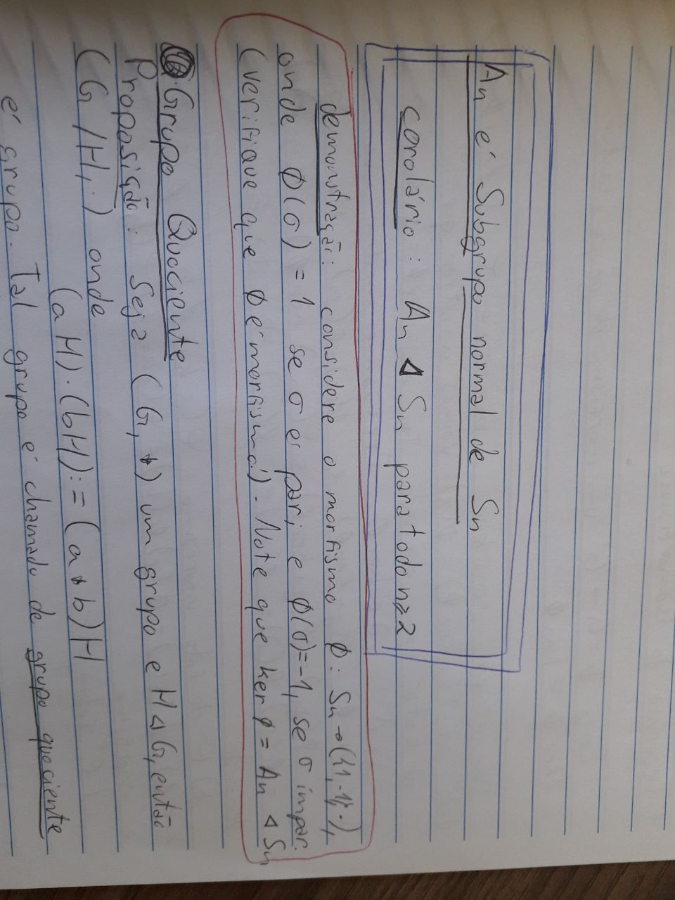
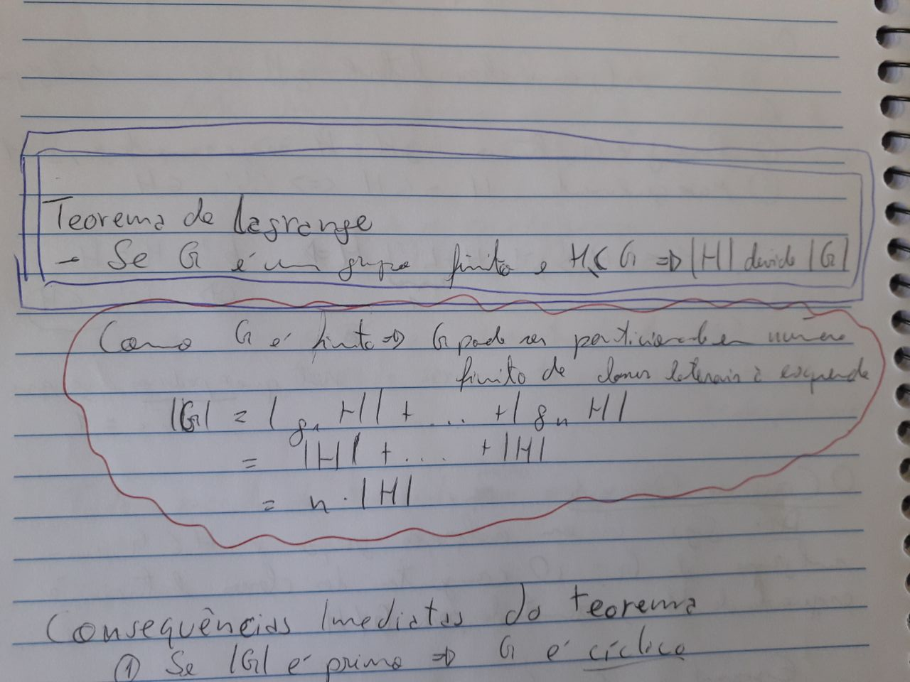
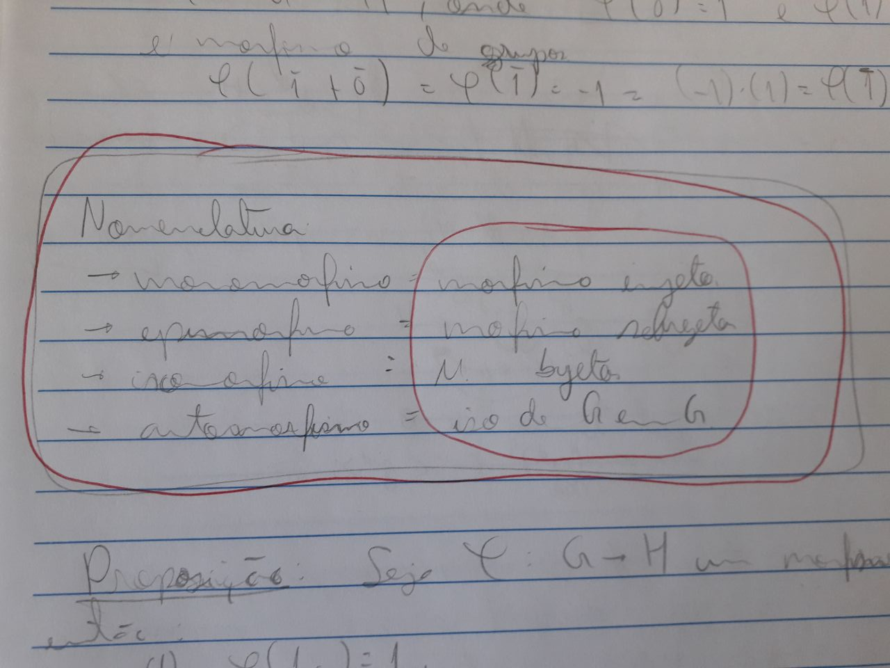
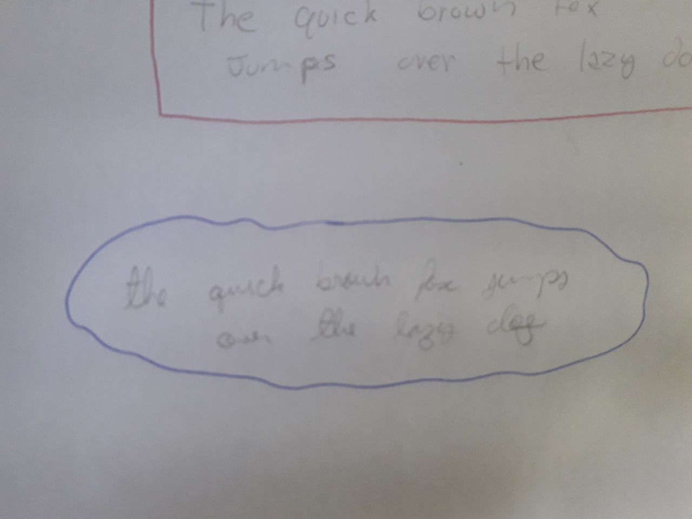
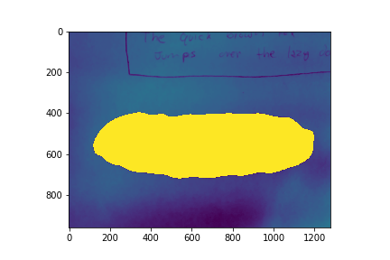
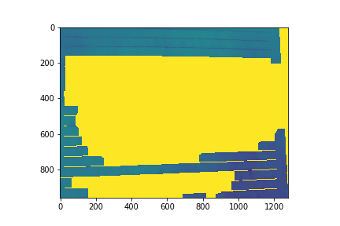

# scc0251 - Final Project : Segmentation of Handwritten Notes for Fast Flashcard Generation

Author: Tobias Mesquita Silva da Veiga, 5268356

This is my final project of the Image Processing lectures taught at the ICMC-USP in 2020.01.

## Abstract

The goal here is to create an algorithm capable of 1) receiving real photos of handwritten students notebooks in which blocks of content are highlighted and 2) Returning the segmented region with only the highlighted content (this will be a side of a flashcard), while also 3) using OCR to retrieve textual information that could be used for recommending tags for the flashcard.

Therefore this project targets the educational area, through the use of image segmentation techniques. 

Below are some examples of handwritten notes with highlighted content that the algorithm is supposed to segment.

## Partial Report

**Main objective:** to segment higlighted regions in students notes.

**Image dataset:** the pictures were taken by a cell cellphone and no lightning, color or angle control was stricly used, as the algorithm would be expected to work in a wide range of cenarios. The dataset so far contains three pictures from a notebook with horizontal lines and other two (as sugested by the teacher) with a blank background. All pictures have 960 x 1280 resolution. Once I manage to get good results with these pictures I will collect more.

**Method:** Here I will explain the current pipeline and discuss some possible improvements for the final report.

1) Blurring the image (for better thresholdind)
2) Grayscale transformation
3) Thresholding: adaptative gaussian thresholding. Global thresholding was not interesting since in study enviroments, light sources and shadows can make the notebook paper have a large range of brightness for the whole content.
4) Closing: this one is essential to fill in the gaps that were created after thresholding.
5) Findding contours: cv2.findContours function is used.
6) Filling countours with a minimum pixel área.

The current method fails in a situtation where two contours are touching each other, the algortihm understands all as just one big contour. Maybe this could be avoided if thresholding especificaly for a given color range, in a way that blue contours would not be confused with red contours.

Another possible improvement is to try different algorithms to fill in the contours, such as region growing and watershedding.

**Partial results** So far, I have maneged to segment regions with blank paper sheets (thanks for the idea, Moacir). But when the background contains the notebooks horizontal lines, it becomes harder. Below are some examples. The inital code can be found in scripts/initial_code(partial_report).ipynb.

